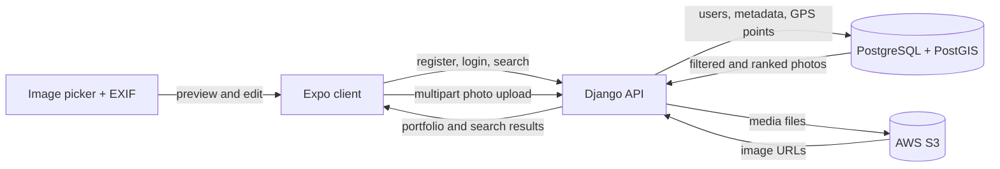

# Geospatial Photography Discovery & Portfolio Platform

> A web and mobile photography app for sharing work, building a portfolio, and finding inspiration through location and camera details.

The app combines a React Native and Expo frontend with a GeoDjango backend. Photographers can upload images, review the camera information saved in them, publish them to a personal portfolio, and search for other photos by location, date, equipment, and camera settings.

This repository contains the current working prototype. Account management, uploads, portfolios, and camera-based search work across the shared codebase. Location ranking and wider support for native devices are still being developed.


## Technical highlights

### Frontend engineering

- **One app for web and mobile** — React Native, Expo, Expo Router, and TypeScript provide a shared codebase for browsers and native devices.
- **Uploads with camera details** — Expo Image Picker reads available EXIF data, rejects files larger than 50 MB, and lets users add or correct details before previewing a photo.
- **Detailed photo filtering** — the search interface supports location, time period, camera, lens, ISO, aperture, shutter speed, focal length, and flash filters.
- **Secure login on each platform** — native clients keep credentials in Expo SecureStore, while the web client uses secure cookies and stores only token-expiry information locally.
- **Shared app state** — React contexts manage authentication, loading feedback, user messages, uploads, and immediate portfolio updates after a successful request.
- **Responsive portfolio interface** — reusable photo cards, modal previews, navigation, and profile grids present the same content across different screen sizes.

### Backend engineering

- **Location-based photo data** — GeoDjango and PostGIS store photo locations and calculate how far each photo was taken from the user's search position.
- **Useful results when exact matches are limited** — the API applies exact EXIF filters first, then ranks related photos by camera, lens, ISO, focal length, shutter speed, other details, and distance.
- **Photo upload processing** — multipart uploads include the image and its EXIF fields. The backend reuses camera and lens records, prepares GPS data, gives each file a unique UUID name, and saves the result.
- **JWT login with refresh sessions** — short-lived access tokens are backed by server-side sessions, allowing the app to refresh a login without asking the user to sign in again.
- **Login support for web and mobile** — browsers receive secure `HttpOnly` cookies, while native clients receive tokens and session IDs for secure storage on the device.
- **Protected media ownership** — authenticated upload and deletion routes identify the current user and prevent one account from deleting another account's photos.
- **Cloud storage and deployment** — Django uses AWS S3 for uploaded media and static files, while Docker packages Gunicorn and the mapping libraries required by GeoDjango.

## What the current version can do

- Register an account and sign in or out.
- Restore an existing authenticated session when the app starts.
- Select a photo from the device and read its available EXIF metadata.
- Add or correct camera, lens, location, and exposure details before upload.
- Preview a photo and its metadata before publishing it.
- Upload photos to an account-owned portfolio backed by AWS S3.
- Browse recent photos in a three-column discovery feed.
- Filter photos by date, location, equipment, and camera settings.
- Open a photo to view its photographer and available shooting details.
- View a photographer's profile and portfolio.
- Delete photos from their own portfolio.

## Product walkthrough

<details>
<summary><strong>Create an account</strong></summary>

<p align="center">
  
</p>
</details>

<details>
<summary><strong>Upload a photo</strong></summary>

<p align="center">
  
</p>
</details>

<details>
<summary><strong>Search by camera details</strong></summary>

<p align="center">
  
</p>
</details>

<details>
<summary><strong>View a portfolio</strong></summary>

<p align="center">
  
</p>
</details>

## How the pieces fit together


```mermaid
flowchart LR
    Client[Expo client] -->|register, login, search| API[Django API]
    Picker[Image picker + EXIF] -->|preview and edit| Client
    Client -->|multipart photo upload| API
    API -->|users, metadata, GPS points| PG[(PostgreSQL + PostGIS)]
    API -->|media files| S3[(AWS S3)]
    PG -->|filtered and ranked photos| API
    S3 -->|image URLs| API
    API -->|portfolio and search results| Client
```

When a user selects a photo, the app reads any camera details supplied by the device and shows them in an editable form. The image and confirmed details are then sent to Django together. Django links the upload to the signed-in user, stores its searchable information in PostgreSQL/PostGIS, and saves the image in AWS S3.

Search requests can include a time range, location, and camera settings. The API returns exact matches first. If there are not enough, it adds related results and gives more weight to similar equipment, camera settings, and nearby photos.

## Key engineering decisions

### One client across platforms

Expo and React Native allow the main screens, components, and app state to be shared between web and mobile. Separate platform logic is only used where behavior differs, such as file uploads, cookies, and secure credential storage.

### Camera details stay editable

EXIF data can be missing, incorrect, or removed by editing software. The upload flow uses the extracted details as a starting point and lets the photographer review or correct them before publishing.

### Exact matches with a useful fallback

Combining several camera and exposure filters can return very few photos. The backend keeps exact results first, removes duplicates, and adds the closest related matches so the user can still discover relevant work.

### Sessions support short-lived access tokens

JWTs protect signed-in API requests, while longer-lived server sessions keep users logged in. If an access token expires, the app can replace it without storing a long-lived JWT.

### Location is stored as geographic data

Photo coordinates use a PostGIS geography field instead of plain text values. This lets the backend calculate real distances and supports location-based discovery as the ranking is improved.

## Stack

| Layer | Technology |
| --- | --- |
| Cross-platform application | Expo 53, React Native 0.79, React 19, TypeScript |
| Navigation and UI | Expo Router, Expo Image, React Native Reanimated, Expo Vector Icons |
| Device features | Expo Image Picker, Expo Location, Expo SecureStore, Expo File System |
| Forms and validation | Formik, Yup |
| API | Python 3.13, Django 5.2, Gunicorn |
| Data and geospatial search | PostgreSQL, PostGIS, GeoDjango, GDAL, GEOS, PROJ |
| Authentication | PyJWT, server-side sessions, secure `HttpOnly` cookies |
| Media storage | AWS S3, `django-storages`, Boto3 |
| Delivery | Docker, GitHub Actions, Expo Application Services |

## Repository map

```text
photography-app/
├── frontend/                       Expo and React Native application
│   ├── app/
│   │   ├── (tabs)/                 Discovery, portfolio and authentication routes
│   │   ├── components/             Upload, search, photo and form UI
│   │   └── lib/                    Auth, shared state, types and client helpers
│   ├── components/                 Platform-specific location picker implementations
│   └── assets/                     Fonts and interface artwork
├── backend/                        Django and GeoDjango API
│   ├── accounts/                   Users, profiles, sessions and account routes
│   ├── media/                      Photos, equipment, search and upload routes
│   ├── photoapp/                   Settings, root routes and JWT middleware
│   ├── lib/                        Authentication helpers
│   └── Dockerfile                  GeoDjango production image
├── .github/workflows/              Automated build workflow
└── img/                            README demonstrations
```

Good starting points for exploring the implementation:

- [`PhotoUpload.tsx`](frontend/app/components/PhotoUpload.tsx) — image selection, size validation, metadata collection, preview, upload, and token refresh.
- [`ExifForm.tsx`](frontend/app/components/ExifForm.tsx) — reusable metadata editing and search-filter form.
- [`SearchBar.tsx`](frontend/app/components/SearchBar.tsx) — location, time-period, and detailed filter controls.
- [`AuthService.ts`](frontend/app/lib/AuthService.ts) — platform-specific sessions, token storage, and refresh behavior.
- [`photo_view.py`](backend/media/views/photo_view.py) — photo search serialization and authenticated upload handling.
- [`PhotoManager.py`](backend/media/lib/PhotoManager.py) — time filters, exact EXIF matching, and weighted fallback ranking.
- [`auth_middleware.py`](backend/photoapp/middleware/auth_middleware.py) — JWT extraction and validation across browser and native requests.
- [`account_views.py`](backend/accounts/views/account_views.py) — registration, login controls, session creation, and logout.

## Current status

The current prototype covers the main full-stack journey: a photographer can create an account, choose and describe a photo, upload it to cloud storage, show it in a portfolio, and search other work using camera details. The shared Expo frontend and GeoDjango backend provide a base for the web and mobile app, while the limitations below show what still needs work.

## Future improvements

- Add likes so users can save and return to photos that inspire them.
- Let users save and follow other photographers' portfolios.
- Add portfolio themes, profile images, albums, and drag-to-reorder controls.
- Add password recovery and account settings for changing passwords and usernames.
- Refine proximity ranking and expand automated test coverage around geospatial search.
- Complete and verify the native photo-upload experience on Android and iOS.

## Known issues

- Some page-load animations do not run consistently.
- The iOS application has not yet been tested.
- Photo uploads are currently broken on Android.
- Proximity search calculates distance, but distance ranking does not yet behave as intended.
